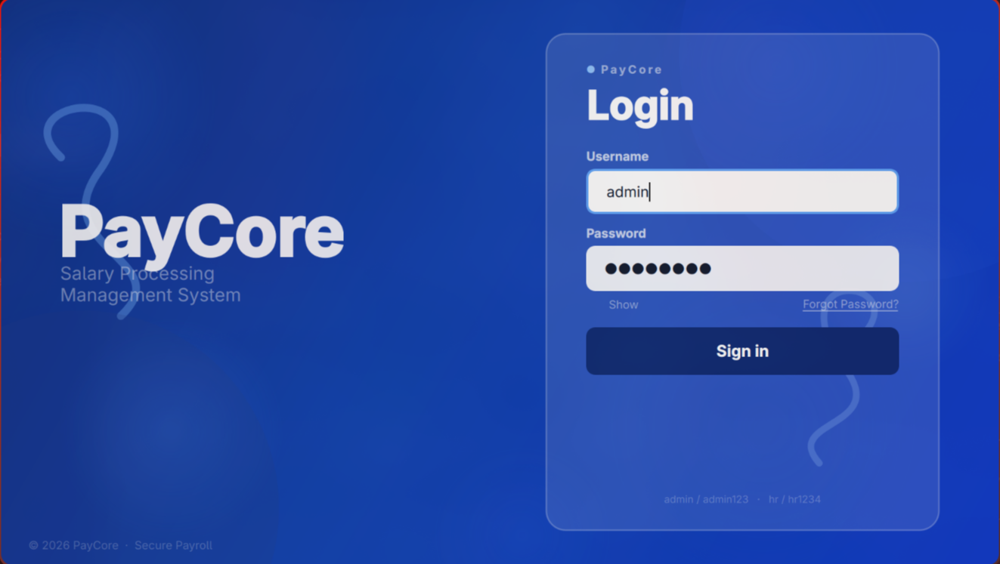
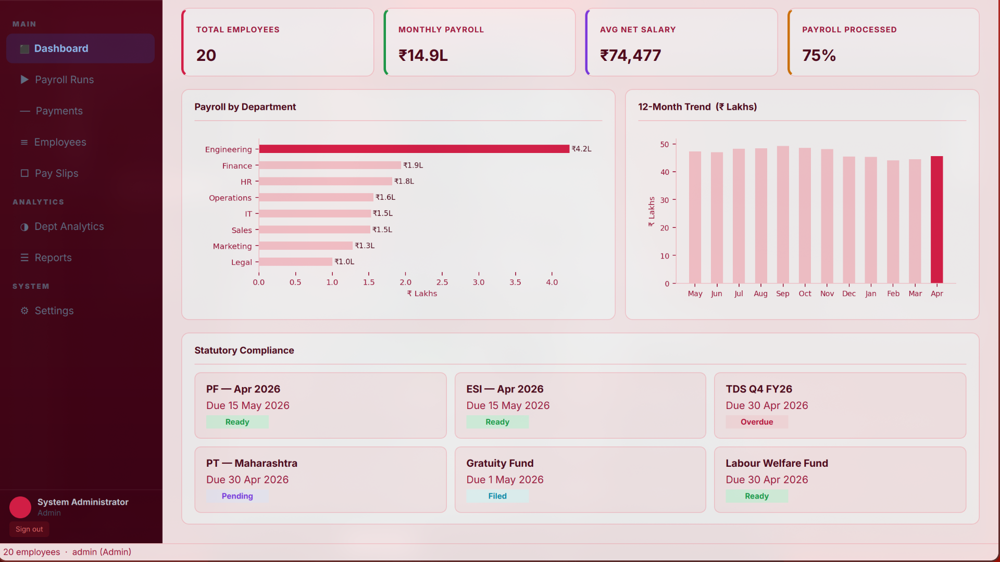
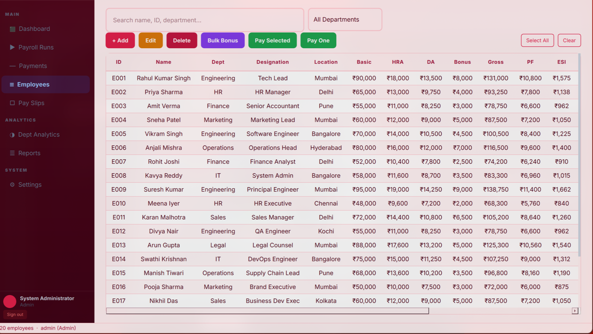
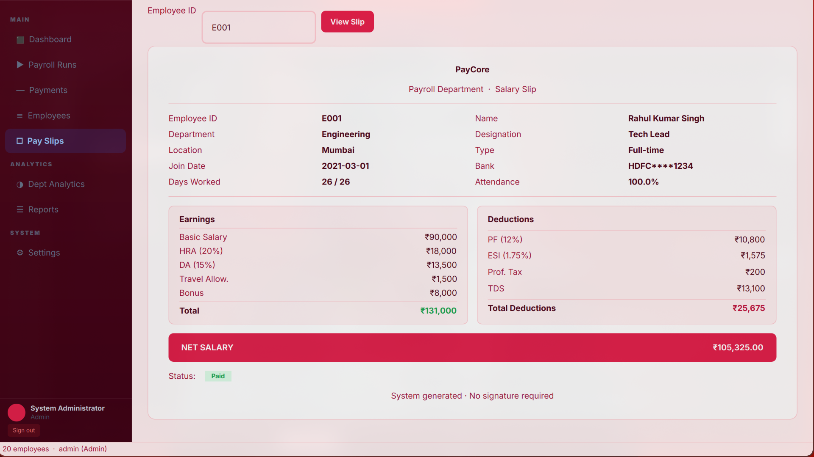
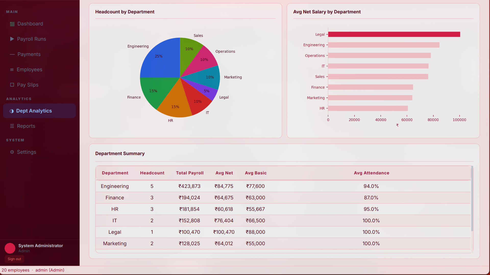
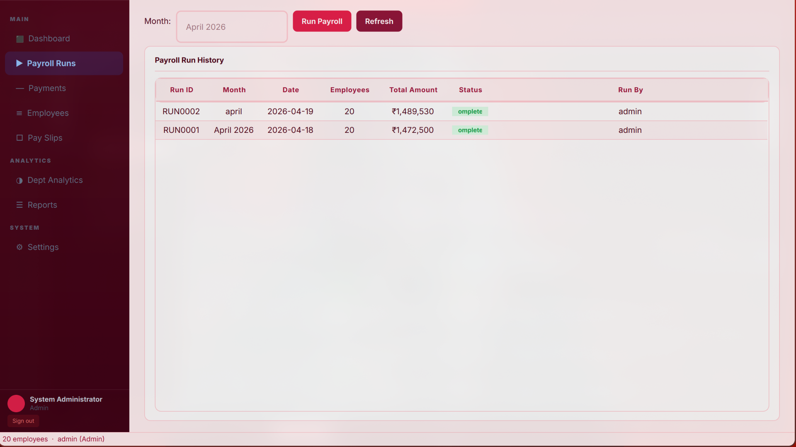

# PayCore — Salary Processing System

<div align="center">


**A complete, production-ready HR & Payroll Management System — desktop + web, no database server required.**

[Quick Start](#quick-start) • [Features](#features) • [Screenshots](#screenshots) • [Installation](#installation) • [Usage](#usage) • [Architecture](#system-architecture) • [Tech Stack](#tech-stack)

</div>

---

## Overview

**PayCore** is a full-featured desktop and web-based **Salary Processing & HR Management System** built with Python, PyQt5, and Streamlit. HR teams and administrators can manage employee records, run monthly payroll, process salary payments, generate pay slips, and analyze department-level data — all from a polished, modern interface.

All data is stored in plain **JSON files** — no database server required. Everything works out of the box after a single `pip install`.

---

## Problem Statement

Small and medium-sized companies in India often struggle with payroll management due to:

- Expensive cloud SaaS payroll tools with recurring subscriptions
- Manual spreadsheet workflows prone to formula errors and data loss
- No audit trails or Indian statutory compliance tracking (PF, ESI, TDS, PT)
- Complex ERP systems requiring dedicated IT infrastructure
- No centralized system for employee records, pay slips, and payment history

**PayCore** solves this with a **self-hosted, offline-capable, zero-server** payroll system installable in minutes.

---

## Quick Start

### Desktop App (PyQt5)
```bash
git clone https://github.com/zyphoryx/Salary_Processing_System.git
cd Salary_Processing_System
pip install -r requirements.txt
python run.py
```

### Web App (Streamlit)
```bash
pip install -r requirements.txt
streamlit run streamlit_app.py
```

### Default Login Credentials

| Username | Password   | Role  |
|----------|------------|-------|
| `admin`  | `admin123` | Admin |
| `hr`     | `hr1234`   | HR    |

> Change credentials after first login via **Settings → Change Password**

---

## Screenshots

### Login Screen
> Animated glassmorphism UI with floating gradients and SHA-256 authentication



---

### Dashboard
> Live KPI cards — 20 employees, ₹14.9L monthly payroll, ₹74,477 avg net salary, 75% processed



---

### Employee Management
> Full salary register with search, filter, add/edit/delete, bulk bonus, and pay actions



---

### Pay Slip Generator
> E001 — Rahul Kumar Singh · Gross ₹1,31,000 · Net ₹1,05,325 · Status: Paid



---

### Department Analytics
> Headcount pie chart, avg net salary bar chart, and full department summary table



---

### Payroll Runs
> RUN0002 — April 2026 · 20 employees · ₹14,89,530 total · Completed by admin



---

## Features

### Security & Login
- Animated glassmorphism login screen with floating blob gradients
- SHA-256 hashed passwords — no plain-text storage ever
- Role-based access control: **Admin** and **HR**
- Session tracking with last-login timestamps
- Change password and logout functionality

### Dashboard
- Live KPI cards: Total Employees, Monthly Payroll, Avg Net Salary, % Processed
- Department payroll breakdown bar chart (Matplotlib)
- 12-month payroll trend chart
- Statutory compliance panel (PF, ESI, TDS, PT, Gratuity, LWF)

### Payroll Runs
- One-click payroll execution for any month
- Full run history: ID, date, employees, total amount, status
- Persisted to `data/payroll_runs.json`

### Payments
- Process individual salary payments per employee
- Methods: Bank Transfer / UPI / Cheque / Cash
- Pending and completed payment history
- Persisted to `data/payments.json`

### Employees
- Complete employee register with all salary fields
- Add / Edit / Delete / Bulk Bonus
- Search by name, ID, department, location
- Filter by department
- Color-coded net salary and pay status badges (Paid / Review / Hold)

### Pay Slips
- Generate company-branded pay slips by Employee ID
- Full earnings breakdown + deductions + net salary + payment status

### Department Analytics
- Pie chart: headcount by department
- Bar chart: average net salary by department
- Summary table with totals, averages, and attendance %

### Reports & Audit
- Append-only audit log for every data-modifying action
- Department-wise salary summary report

### Payroll Computation (Auto-calculated)

| Component         | Formula                                          |
|-------------------|--------------------------------------------------|
| HRA               | 20% of Basic                                     |
| DA                | 15% of Basic                                     |
| Travel Allowance  | ₹1,500 flat                                      |
| Gross             | Basic + HRA + DA + TA + Bonus                    |
| PF                | 12% of Basic                                     |
| ESI               | 1.75% of Basic                                   |
| Professional Tax  | ₹200 flat                                        |
| TDS               | 10% if Gross > ₹50k / 5% if > ₹30k              |
| Net Salary        | (Gross − Deductions) × Attendance %              |
| Pay Status        | Paid ≥ 90% \| Review ≥ 75% \| Hold < 75%        |

### Streamlit Web Interface
- Full browser-based interface — all desktop features included
- Shared JSON data files with desktop app
- Run with `streamlit run streamlit_app.py`

---

## Data Storage

All data stored as UTF-8 JSON in `data/`. **No database server required.**

| File               | Contents                                      |
|--------------------|-----------------------------------------------|
| `employees.json`   | Employee records (salary recomputed on load)  |
| `users.json`       | Accounts with SHA-256 hashed passwords        |
| `payments.json`    | Complete payment history                      |
| `payroll_runs.json`| Payroll run records                           |
| `audit_log.json`   | Timestamped audit trail                       |
| `settings.json`    | Active theme setting                          |

---

## System Architecture

```
Salary_Processing_System/
│
│  ┌─────────────────────────────────────────────────────┐
│  │              PRESENTATION LAYER                     │
│  │   login.py · main.py · styles.py (Desktop)         │
│  │   streamlit_app.py               (Web)             │
│  └──────────────────────┬──────────────────────────────┘
│                         │
│  ┌──────────────────────▼──────────────────────────────┐
│  │              BUSINESS LOGIC LAYER                   │
│  │   tabs.py · dialogs.py · widgets.py                │
│  └──────────────────────┬──────────────────────────────┘
│                         │
│  ┌──────────────────────▼──────────────────────────────┐
│  │                 DATA LAYER                          │
│  │   database.py  →  data/*.json                      │
│  └─────────────────────────────────────────────────────┘
```

---

## Project Structure

```
Salary_Processing_System/
├── run.py                    ← Desktop app entry point
├── streamlit_app.py          ← Web UI entry point
├── requirements.txt
├── README.md
├── CONTRIBUTING.md
├── CHANGELOG.md
├── KNOWLEDGE_BASE.md
│
├── paycore/                  ← Desktop application source
│   ├── __init__.py
│   ├── main.py               ← Main window & sidebar
│   ├── login.py              ← Glassmorphism login screen
│   ├── database.py           ← JSON backend & payroll engine
│   ├── tabs.py               ← All 8 tab panels
│   ├── dialogs.py            ← Add/Edit modal dialogs
│   ├── widgets.py            ← KPICard, StatusBadge, etc.
│   └── styles.py             ← Light/Dark theme system
│
├── data/                     ← JSON data store (auto-created)
│   ├── employees.json
│   ├── users.json
│   ├── payments.json
│   ├── payroll_runs.json
│   ├── audit_log.json
│   └── settings.json
│
└── docs/
    └── screenshots/
        ├── login.png
        ├── dashboard.png
        ├── employees.png
        ├── payslip.png
        ├── analytics.png
        └── payroll.png
```

---

## Component Description

| File               | Role                                                                 |
|--------------------|----------------------------------------------------------------------|
| `run.py`           | Entry point — configures path and launches Qt app                   |
| `main.py`          | Main window: gradient sidebar, tab switcher, QThread loader         |
| `login.py`         | Animated glassmorphism login with GlassBackground widget            |
| `database.py`      | JSON CRUD, SHA-256 auth, payroll engine, audit logging              |
| `tabs.py`          | 8 tabs: Dashboard, Payroll, Payments, Employees, PaySlips, Analytics, Reports, Settings |
| `dialogs.py`       | Modal dialogs for employee and payment operations                   |
| `widgets.py`       | KPICard, StatusBadge, CardFrame, Divider                            |
| `styles.py`        | Light/Dark theme palettes and Qt stylesheet generator               |
| `streamlit_app.py` | Full web UI — all features in browser                               |

---

## Tech Stack

| Layer       | Technology        | Purpose                      |
|-------------|-------------------|------------------------------|
| Language    | Python 3.8+       | Core programming language    |
| Desktop UI  | PyQt5 5.15+       | Desktop GUI framework        |
| Web UI      | Streamlit 1.30+   | Browser-based interface      |
| Analytics   | pandas 1.5+       | Data manipulation            |
| Charts      | Matplotlib 3.5+   | Visualizations               |
| Storage     | JSON flat files   | Zero-server persistent store |
| Security    | SHA-256 (hashlib) | Password hashing             |

> Note: PySpark dependency removed. All computation done with pure Python/pandas for simpler deployment.

---

## Dependencies

```
PyQt5>=5.15.0
pandas>=1.5.0
matplotlib>=3.5.0
streamlit>=1.30.0
```

---

## Installation

```bash
# 1. Clone the repository
git clone https://github.com/zyphoryx/Salary_Processing_System.git
cd Salary_Processing_System

# 2. Create virtual environment (recommended)
python -m venv venv
source venv/bin/activate        # Linux/macOS
venv\Scripts\activate           # Windows

# 3. Install dependencies
pip install -r requirements.txt

# 4a. Launch Desktop App
python run.py

# 4b. Launch Web App
streamlit run streamlit_app.py
```

---

## Usage

| Task             | Steps                                                      |
|------------------|------------------------------------------------------------|
| Run Payroll      | Payroll Runs → enter month → Run Payroll                   |
| Add Employee     | Employees → + Add → fill form → Save                       |
| View Pay Slip    | Pay Slips → enter ID (e.g. E001) → View Slip               |
| Process Payment  | Payments → select employee + method → Process              |
| View Analytics   | Dept Analytics → pie chart + bar chart + summary           |
| Switch Theme     | Settings → toggle Light / Dark                             |
| Web Access       | `streamlit run streamlit_app.py` → open browser            |

---

## Future Improvements

- [ ] PDF export for pay slips (ReportLab)
- [ ] Excel export for salary reports
- [ ] Email pay slips via SMTP
- [ ] SQLite / PostgreSQL backend for scale
- [ ] Leave and attendance management module
- [ ] Multi-company / multi-branch support
- [ ] Tax filing reports (Form 16, PF ECR, ESI challans)
- [ ] Salary revision history per employee
- [ ] REST API with FastAPI
- [ ] Packaged installer (.exe / .dmg / .AppImage)

---

## Contributing

1. Fork the repository
2. Create branch: `git checkout -b feature/your-feature`
3. Commit: `git commit -m 'Add feature'`
4. Push: `git push origin feature/your-feature`
5. Open a Pull Request

---

## Conclusion

PayCore is a zero-server, dual-interface payroll management system built for Indian SMEs. It automates monthly salary computation including all statutory deductions (HRA, DA, PF, ESI, TDS) with a tamper-evident audit trail, role-based access, and department analytics — no database or cloud subscription required.

Built as a Data Engineering project, it demonstrates practical application of Python, PyQt5, Streamlit, pandas, and Matplotlib in a domain that directly impacts working professionals across India.

---

## Contact

**Rahul Kumar Singh** · Data Engineering Project

📧 rahulkumarsingh090807@gmail.com

---

<div align="center">

If this project helped you, please give it a star!

</div>
